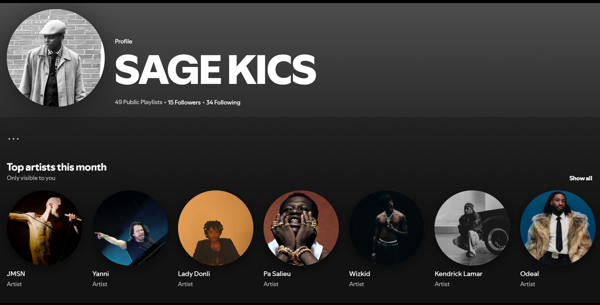
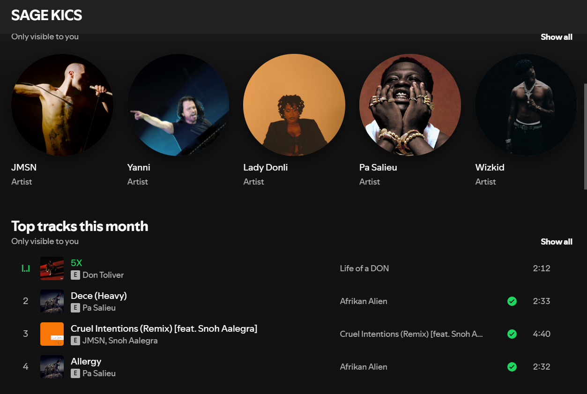

# My Love for Music: A Journey Through Sound
 

## Introduction to My Spotify Playlists

Music is more than just sound; it's an expression of emotions, a mood-setter, and a journey through different cultures and experiences. I’m **Carrington**, and my playlist collection on Spotify, SAGE KICS, reflects my eclectic love for R&B, Neo Soul, Retro, Afrobeat, Rap etc and the vibes that match every moment of my life.

### Top Playlists Curated by Me

Here are the top 5 playlists I've created for your listening pleasure:

1. **All Shades Of Moist** (R&B/Neo Soul)  
   [Listen here](https://open.spotify.com/playlist/6ggnG807cLD2yoZkigIMWT?si=6CBVVewoTWCt6lvprT10tA&pi=re2vH5sCQDCkC)

2. **My 420 Vibes**  
   [Listen here](https://open.spotify.com/playlist/0mlimJQOeeE3lVVPCa7zfe?si=dDz1jB11RgG9mx9FCHUy3Q&pi=Nn2_sK2BRQmRq)

3. **Alte Cruise**  
   [Listen here](https://open.spotify.com/playlist/0qdSDpM7slqhORPYbYxPHg?si=n56PvOmKROC9c0iUBu0_6Q&pi=TjIYlAx6RIqP1)

4. **I AM HIM**  
   [Listen here](https://open.spotify.com/playlist/5R7P82jfJEZcox5rR1KeRC?si=BK7MNvYkSEOb8yIvde3nNw)

5. **SOUL**  
   [Listen here](https://open.spotify.com/playlist/2b2CE66q6HsjfHeV1LIo2b?si=9lpWiKssRO6QH62k6OJ3qQ)

---

## Why These Playlists?

I curate music for every feeling, every mood. Here’s a quick breakdown:

### Genres I Love:
- **R&B**: Soulful, smooth, and always emotional.
- **Neo Soul**: A mix of deep groove and jazzy vibes.

### What You’ll Find:
- **Chill vibes** for winding down.
- **Upbeat energy** to get your day started.
- **Soulful melodies** to connect with your emotions.

---

## My Overall Playlist Collection

If you're curious about all the music I’ve curated, check out my overall playlist collection on Spotify:

[Explore more on SAGE KICS](https://open.spotify.com/user/h5ymwyuygm3bb6j1dp688fnqh?si=UuNdyxLiTl60cNuVUW9poA)

---

## Let’s Keep the Vibes Going

Music is my personal journey, and I’d love for you to join me. Whether you're vibing to R&B, cruising through some **Alte**, or feeling the soulful beats, there’s always a playlist for every mood.

So, what are you waiting for? Press play, and let the music take over!

---

## Conclusion

With music as the soundtrack to our lives, my playlists are designed to reflect the diverse moods we all experience. Don’t forget to follow me on Spotify for more musical gems!

